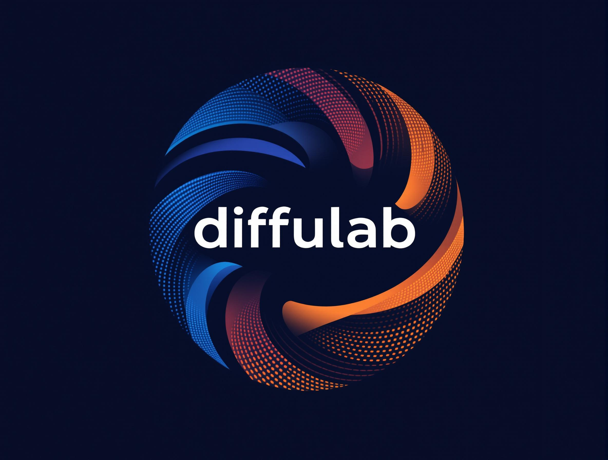

<p align="center">
    
</p>

# DiffuLab: Easily Train Diffusion Models from Scratch

## Installation

The easiest way to use DiffuLab is with [Astral UV](https://docs.astral.sh/uv/):

```bash
git clone git@github.com:LouisRouss/DiffuLab.git
cd DiffuLab
uv sync
uv pip install -e .
```

## Concept of the Library

DiffuLab is designed to provide a simple and flexible way to train diffusion models while allowing full customization of its core components. The library is structured around three major building blocks:

1. **Architecture** (e.g., U-Net, DiT)
2. **Formalization** (e.g., Rectified Flow, DDPM, EDM)
3. **Sampler for inference**

This project is in its early stages, and contributions are highly encouraged. The initial goal is to implement fundamental features and ensure they work seamlessly. Future updates will introduce additional functionalities, such as:
- Adapters
- Fine-tuning with LoRA
- Feature injection into the architecture for specialized inference scenarios

## Launching a Training Session

To start training a model, follow the provided [examples](examples/). Before running any training, make sure to configure `accelerate` in your terminal:

```bash
accelerate config
```

After setting up, you can launch training scripts as demonstrated in the examples directory.

---

Stay tuned for updates and feel free to contribute!


# To-Do List

Here is a To-Do list, feel welcome to help to any point along this list. The already done code may not be error free so don't hesitate to also openPR to correct it.

- [x] add possibility to change timestep for sample DDPM
- [x] doc string and comment
- [ ] Make the implementation of the DiT architecture more versatile
- [ ] add reflow algorithm
- [ ] add mixed precision training
- [ ] add some context embedders
- [ ] add EDM
- [ ] think about how to add a sampler abstraction and use it in the different Diffusion classes
- [ ] Train our models on toy datasets for different tasks (conditional generation, Image to Image ...)
- [ ] Add possibility to train LORA/DORA
- [ ] Add the possibility to diffuse in the latent space (add a vae at initialization of our denoisers)
- [ ] add different sampler
- [ ] Try out Differential Transformers
- [ ] Check to add https://arxiv.org/pdf/2406.02507
- [ ] inject lessons learned from nvidia https://developer.nvidia.com/blog/rethinking-how-to-train-diffusion-models/
